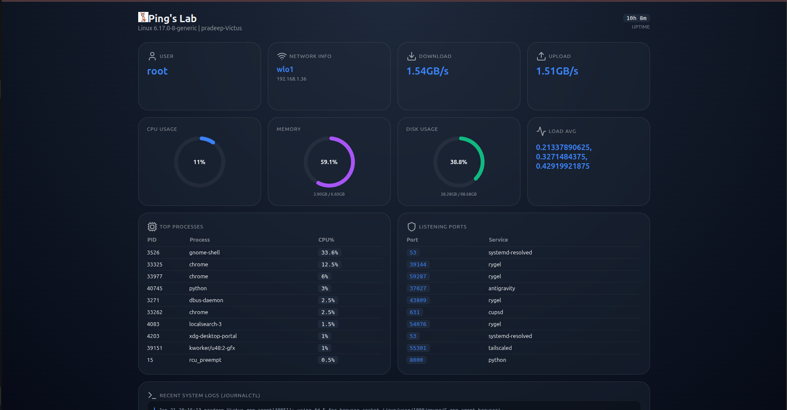

# Linux-Utilities
All scripts and Automatons to make your Linux distro usage more easier.

## 1. System Pulse

System Pulse is a lightweight Linux utility dashboard built with FastAPI that provides real-time visibility into system health using a clean, modern bento-style UI. It is designed to encourage creativity, learning-by-doing, and continuous skill development while working with Linux systems.

Refer for details and installation: [Click](dashboard/README.md)

## 2. Secure Pass

Secure Pass is a lightweight, dependency-free Linux password generator and vault helper written in Python.
It focuses on strong password generation, smooth CLI interaction, and optional GPG-based encryption without forcing virtual environments or Python package installs.

Refer for details and installation: [Click](password/README.md)

